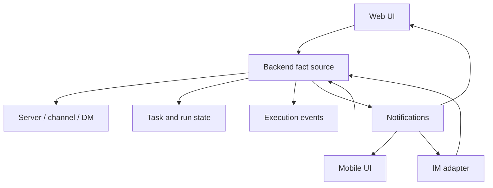

Poco 把交互方式从单一桌面浏览器扩展到更多终端与消息通道。无论入口来自 Web、移动端还是 IM，最终都回到 Backend 的统一事实源。

## 多端交互链路

多端能力的核心不是复制多个 UI，而是让不同入口共享同一套 server、channel、message、task 和 run 状态。

这样用户可以在桌面端创建任务，在手机上查看进度，在 IM 中收到通知，并在回到 Web 后继续查看完整回放。

## 组成部分

这个专题覆盖 Poco 在多端和消息驱动上的能力规划。

- [移动端支持](./mobile)
- [IM 支持](./im)
- [个人部署](./self-hosted)
- [云端订阅](./cloud-subscription)
- [多语言支持](./multilingual)

## 设计边界

多端入口不应该各自保存一份事实。Poco 以 Backend 为事实源，外部终端只负责呈现、通知和触发受控动作。

| 入口   | 适合做什么                 | 不适合做什么           |
| ------ | -------------------------- | ---------------------- |
| Web    | 完整配置、回放、产物预览。 | 作为唯一通知入口。     |
| Mobile | 查看进度、轻量操作。       | 承载复杂配置表单。     |
| IM     | 通知、订阅、快速触发。     | 替代完整执行审计界面。 |
