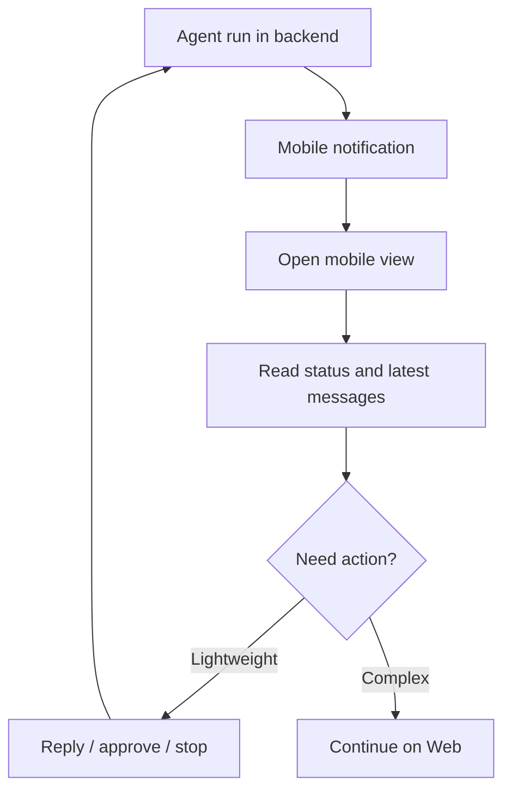

Poco 支持移动场景，让你不在电脑前时也能继续管理 Agent。移动端重点不是完整替代桌面端，而是覆盖查看进度、接收提醒和执行轻量操作。

## 移动端工作流

移动端从 Backend 读取同一份任务和执行状态。用户可以查看 channel、run 状态和通知，再决定是否回到桌面端处理复杂操作。

这种设计让长任务不被桌面浏览器绑住，也避免把复杂开发工作强行塞进手机界面。

## 带来的好处

移动端支持主要服务异步协作。

- 随时查看执行进度。
- 在路上也能触发后续操作。
- 用手机持续跟进长时间任务。
- 在关键节点接收提醒并快速响应。

## 适合的操作

移动端更适合轻量控制，而不是完整开发操作。

| 操作               | 移动端适配度       |
| ------------------ | ------------------ |
| 查看任务状态       | 高。               |
| 回复澄清问题       | 高。               |
| 停止明显错误的任务 | 高。               |
| 大量阅读代码 diff  | 低，推荐回到 Web。 |
