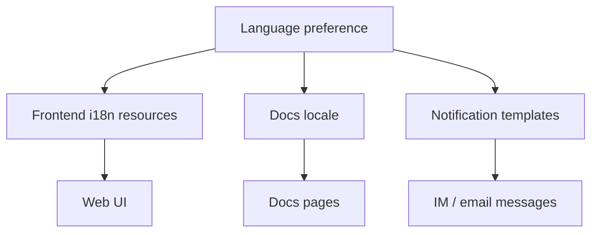

Poco 计划在产品体验与文档两侧都提供多语言能力。多语言支持不只是翻译文案，还需要让功能名称、错误提示、通知和文档结构保持一致。

## 多语言内容链路

产品 UI、文档和 IM 通知都应从统一的语言设置出发。用户切换语言后，界面和通知使用对应资源，文档也进入对应语言目录。

这条链路可以减少同一功能在不同入口中的命名漂移，让用户在 Web、文档和通知里看到一致表达。

## 好处

多语言支持让 Poco 更适合不同团队接入。

- 更适合全球用户接入。
- 不同团队能以更自然的语言协作。
- 更容易对产品与文档做本地化。
- 减少跨语言使用时的理解成本。

## 写作要求

功能文案、错误信息和说明文档都应避免硬编码用户可见文本。新增前端文案需要进入 i18n 资源，新增文档需要同步考虑中英文目录结构。
