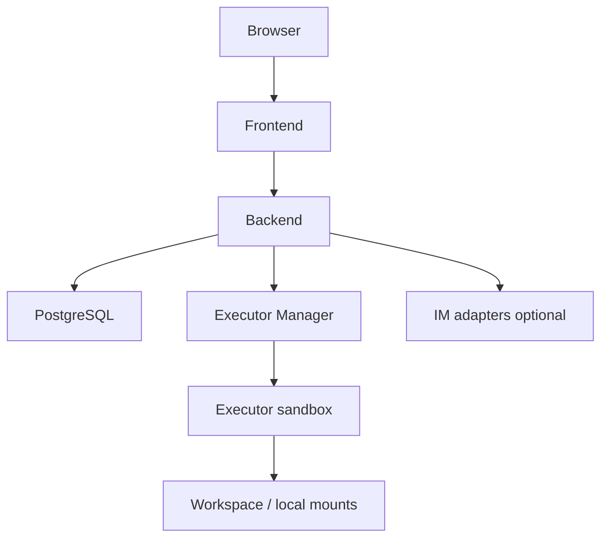

Poco 支持使用 Docker 启动完整运行环境，用于个人或团队自主管理。自托管形态让你掌控运行时、数据和本地目录挂载边界。

## 自托管运行结构

一个完整部署通常包含 Frontend、Backend、Executor Manager、Executor、数据库和可选的 IM adapter。各服务通过内部网络通信，Backend 仍然是事实源。

自托管部署适合需要本地文件访问、内部网络访问或数据自主控制的场景。

## 价值

个人部署强调可控性和完整体验。

- 一键启动本地环境。
- 完整掌控运行时与数据。
- 适合内部使用与实验场景。
- 可以启用本地目录挂载，让 Agent 操作宿主机授权目录。

## 与云端形态的区别

自托管和云端订阅的核心差异在于运行时和数据控制。

| 形态     | 优势                             | 需要承担                     |
| -------- | -------------------------------- | ---------------------------- |
| 自托管   | 数据、网络和本地文件访问更可控。 | 维护服务、数据库和运行环境。 |
| 云端订阅 | 接入更轻，运维成本更低。         | 本地目录挂载等能力会受限。   |
