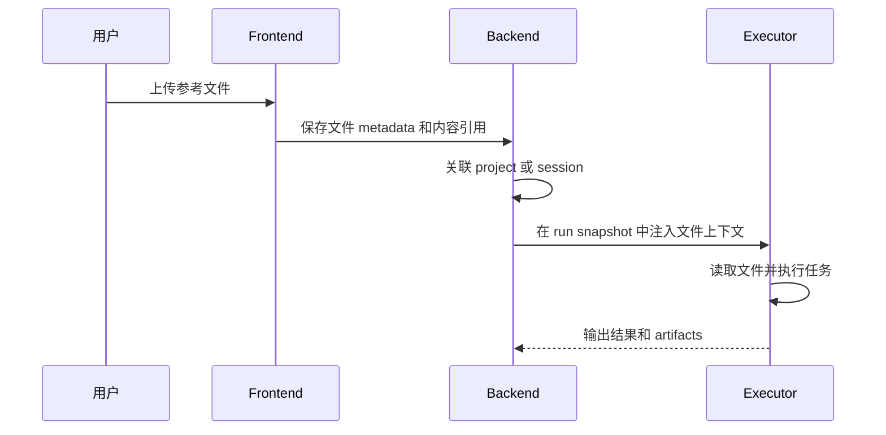

Poco 支持文件型输入，让 Agent 不再只依赖纯文本提示词。用户可以上传参考材料、截图、报告或数据文件，并把它们和任务指令一起交给 Agent 处理。

## 文件进入运行时

上传文件会先被登记为会话或项目上下文，再在 run snapshot 中传递给执行环境。Agent 可以读取这些材料，并在执行过程中生成新的 artifacts。

这个流程把输入文件和输出产物分开。上传文件是任务上下文，Agent 生成并发布的文件才是执行结果。

## 典型场景

文件上传适合需要真实材料参与推理或处理的任务。

- 上传参考文件作为任务上下文。
- 在同一工作流中处理多种文件格式。
- 把用户指令与文件内容结合起来，提升执行质量。
- 根据截图、报告或设计文档生成后续产物。

## 与项目文件的区别

单次上传更适合临时材料，项目文件更适合长期复用。两者都能进入运行上下文，但生命周期不同。

| 类型         | 生命周期             | 适合内容                           |
| ------------ | -------------------- | ---------------------------------- |
| 会话上传文件 | 当前会话或当前任务。 | 临时截图、一次性报告、待处理数据。 |
| 项目文件     | 项目长期上下文。     | 规范、设计文档、固定参考材料。     |
