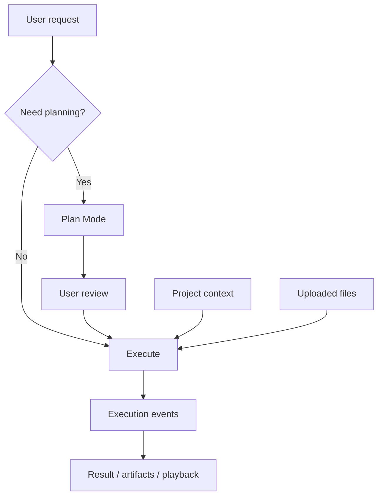

Poco 的核心目标是完成任务执行，而不只是生成一段回复。它把计划、项目上下文、文件输入、执行控制和结果回看组织成完整工作流。

## 从聊天到工作流

普通聊天以单轮回答为中心，Poco 以可执行任务为中心。用户输入可以进入 Plan Mode，可以绑定项目和文件，也可以被调度到后台执行。

这条链路让用户能在执行前校准方向，在执行中补充上下文，在执行后检查过程和结果。

## 包含的能力

这个专题覆盖从对话到任务执行所需的基础能力。

- [计划模式与对话控制](./plan-mode)
- [项目管理](./project-management)
- [文件上传](./file-upload)

## 产品边界

Poco 不把所有能力都压进聊天输入框。项目配置保存稳定上下文，文件上传承载输入材料，Plan Mode 控制执行前决策，回放和产物界面承载执行证据。

| 能力      | 解决的问题                 |
| --------- | -------------------------- |
| Plan Mode | 先规划再执行，降低误操作。 |
| 项目管理  | 沉淀默认配置和上下文。     |
| 文件上传  | 让 Agent 处理真实材料。    |
