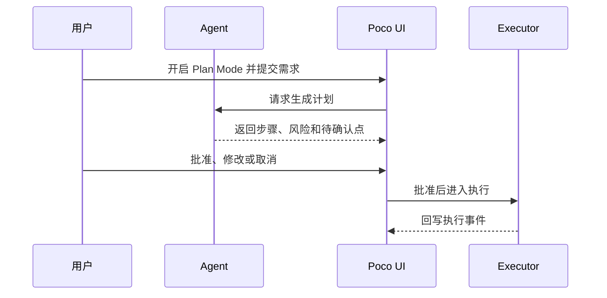
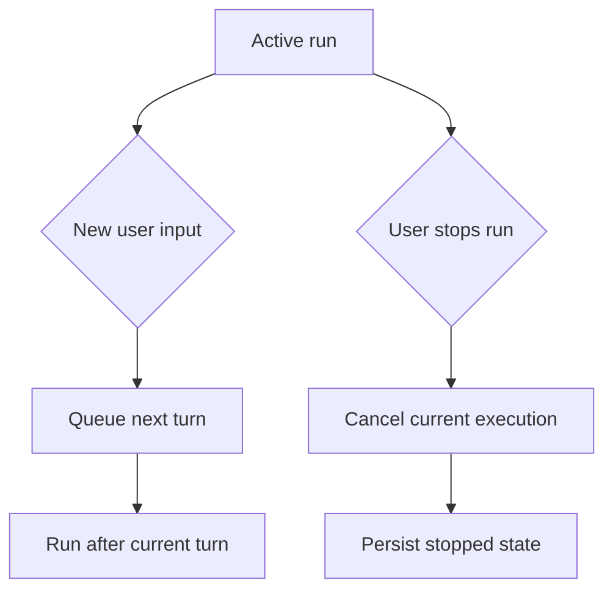

Poco 提供面向工作流的对话控制能力。Plan Mode 用于执行前规划，对话排队用于处理连续输入，终止能力用于在方向错误或风险过高时停止任务。

## Plan Mode 流程

Plan Mode 的核心是先产出计划，再由用户决定是否进入执行。这个阶段不应默认修改文件，也不应把计划和执行混成一步。

这个流程适合代码修改、架构调整、文档批量编辑和任何需要先明确范围的任务。

## 对话排队与终止

长任务运行时，用户可能继续发送补充信息。Poco 需要把这些输入和当前执行状态协调起来，避免多个响应互相覆盖。

排队让连续输入有序处理，终止让错误方向可以干净停止。两者都必须回写状态，方便用户理解当前任务处于什么阶段。

## 亮点

这些控制能力让 Agent 工作流更接近真实协作。

- 使用 **Plan Mode** 在执行前进行结构化规划。
- 支持对话排队，处理多个待响应交互。
- 支持对话终止，让任务可以被干净地停止。
