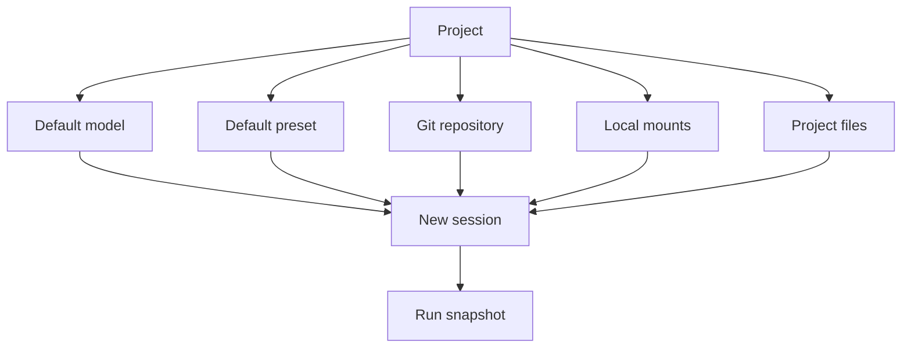

Poco 的项目管理用于沉淀稳定上下文。不同项目可以拥有独立会话历史、默认模型、默认 Preset、仓库、本地挂载和参考文件，避免每次新建任务都重新配置。

## 项目上下文如何进入任务

新建会话或任务时，项目默认值会被展开为运行配置。用户仍可在任务编辑器中覆盖部分字段，但基础上下文来自项目。

Run snapshot 会保存当次执行使用的配置快照，因此后续项目配置变化不会篡改历史执行。

## 项目组织

项目帮助你在不同任务、会话与上下文之间组织工作。

- 不同项目之间完全隔离，任务、会话、配置互不干扰。
- 每个项目有独立的会话历史，方便回溯与追踪。
- 支持编辑项目名称和描述，随时更新项目定位。

## 项目级默认配置

项目级默认值减少重复配置，并让同一项目中的任务保持一致。

- **默认模型**：指定项目常用的模型，新建会话时自动填充。
- **默认 Preset**：绑定一个 Preset 作为项目级运行配置。
- **Git 仓库**：配置默认仓库地址、分支和认证方式。
- **本地挂载**：定义多个宿主机目录挂载，每次运行自动可用。

## 项目文件

项目文件适合放设计文档、规范说明、代码片段和长期参考材料。这些文件会在项目内每次会话运行时自动注入，无需重复上传。
