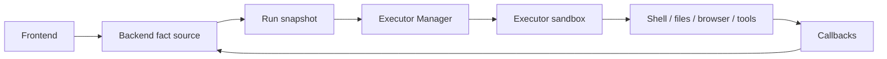

Poco 把高权限执行放进隔离沙箱，而不是让主后端直接运行 shell、浏览器和文件操作。Backend 保存业务事实，Executor 在沙箱中承担执行风险，并通过 callback 回写过程事实。

## 沙箱执行链路

用户请求进入 Backend 后，会被固化为 run 和权限快照。Executor Manager 领取 run，Executor 在隔离环境中执行，并把消息、工具事件、状态和 artifacts 回写。

这个拆分让主后端不直接承受 Agent 长任务和工具权限风险，也让每次执行都有可追踪的边界。

## 为什么重要

隔离执行是 Agent 产品的基础能力。

- 可以自由安装依赖，而不会污染宿主机。
- 可以放心修改、创建和删除沙箱内文件。
- 命令执行与宿主环境隔离，降低本地与共享环境的风险。
- 任务失败时可以通过状态和事件回写定位问题。

## 带来的能力

安全沙箱让 Poco 可以支撑更复杂的编码和自动化任务。

- 更安全地尝试编码任务。
- 每个任务拥有干净的运行环境。
- 会话之间的执行行为更稳定、可复现。
- 可以把本地挂载作为显式授权能力，而不是默认暴露宿主机文件系统。

## 与 Backend 的边界

Backend 是事实源，Executor 是执行面。Executor 可以产生事件和产物，但只有回写并持久化后，Frontend 和后续 Agent 才能把它们当作事实。
