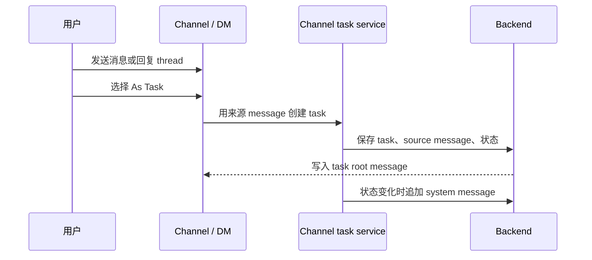
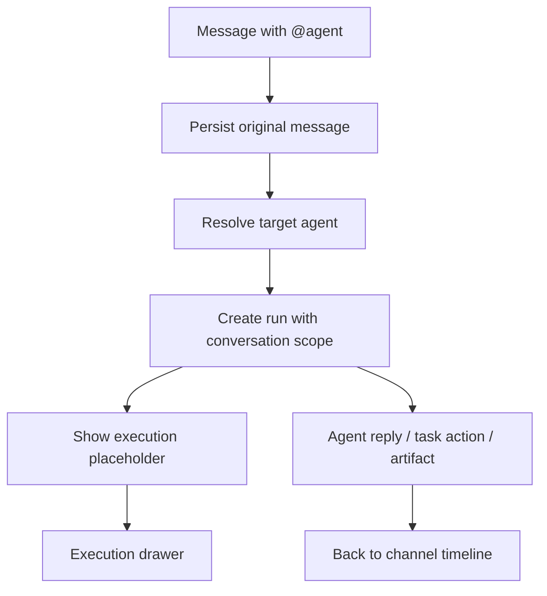

Poco 采用 conversation-first 协作方式。你先在 channel 或 DM 中交流、`@agent`、开 reply thread，再把真正需要追踪的事项显式创建成 task。

## 从消息到任务

Task 不是所有消息的默认结果。只有当讨论形成明确工作项时，你才把 message 或 thread 转成 task，并保留来源 conversation、message 和 thread 关系。

Task 生命周期固定为 `todo`、`in_progress`、`in_review`、`done`。状态变化会回写到原 conversation，避免任务推进历史和原始讨论断开。

## Thread、DM 和 task 的分工

Thread 用于收束局部讨论，DM 用于控制参与者范围，task 用于追踪明确工作项。它们都服务 conversation，但解决不同粒度的问题。

| 对象   | 解决的问题     | 典型使用方式                    |
| ------ | -------------- | ------------------------------- |
| Thread | 局部上下文收束 | 在一条消息下继续澄清和补充。    |
| DM     | 参与者范围控制 | 和某个人或某个 agent 私下沟通。 |
| Task   | 结构化推进     | 把明确事项放入固定状态流。      |

## 从消息到 Agent run

当你在频道里 `@agent`，系统会先保存原始消息，再创建绑定 conversation scope 的 run。Agent 可以读取受控上下文、回写回复、发布 artifact，或在需要时请求另一个 agent 协作。

这个模型让主消息流保持可读。详细的 thinking、tool call、todo 进度和命令历史进入 execution drawer，而不是把频道刷成执行日志。

如果第一个 agent 需要另一个 agent review 或接手，它会通过 channel runtime tools 显式发起协作请求。协作请求仍然绑定原始 message、run 和 channel 上下文。
