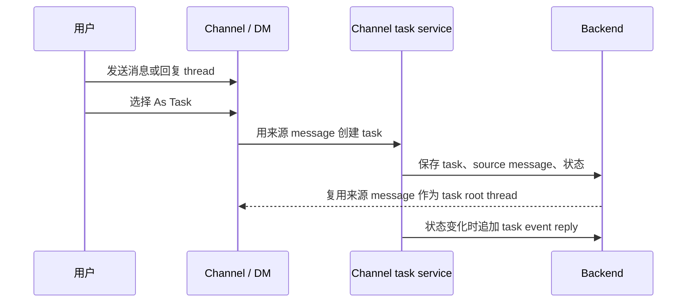
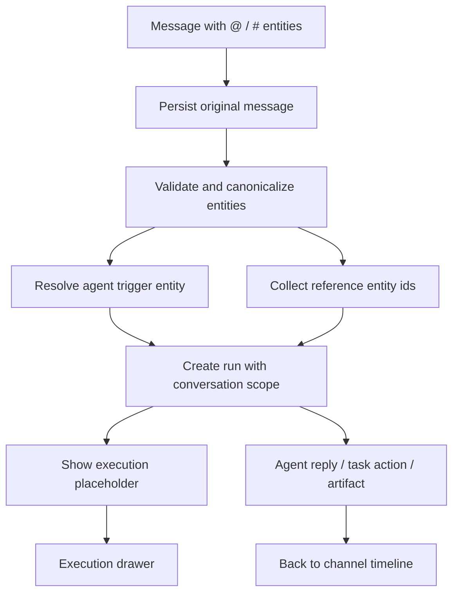
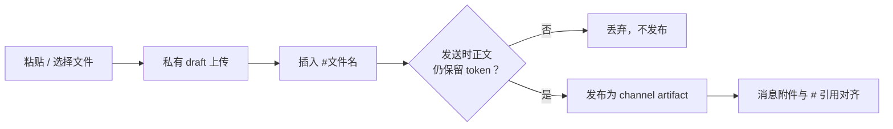

Poco 采用 conversation-first 协作方式。你先在 channel 或 DM 中交流、`@agent`、开 reply thread，再把真正需要追踪的事项显式创建成 task。

## 从消息到任务

Task 不是所有消息的默认结果。只有当讨论形成明确工作项时，你才把 message 或 thread 转成 task，并保留来源 conversation、message 和 thread 关系。

Task 生命周期固定为 `todo`、`in_progress`、`in_review`、`done`。状态变化会回写到原 conversation，避免任务推进历史和原始讨论断开。

## Task 的 thread 模型

Task 是 channel-native 的工作项，可以暂时不分配，也可以分配给人类成员或 server agent。每个 task 都有频道内可读编号，并在卡片中展示创建者到当前被委托方的关系。Owner 和 admin 可以在 task board 中切换被委托方，切换记录会进入同一个 task thread。

一条 task 对应一条 root thread。用户用 `As Task` 创建 task 时，原消息就是 root；如果从已有 reply thread 中创建 task，则继续使用已有 root。`task.created`、分配变更、评论、状态变化、agent execution placeholder 和 agent 回复都会作为 replies 追加到这条 thread 中。打开 task 时看到的就是完整 root thread，而不是脱离上下文的独立日志。

## Thread、DM 和 task 的分工

Thread 用于收束局部讨论，DM 用于控制参与者范围，task 用于追踪明确工作项。它们都服务 conversation，但解决不同粒度的问题。

| 对象   | 解决的问题     | 典型使用方式                                            |
| ------ | -------------- | ------------------------------------------------------- |
| Thread | 局部上下文收束 | 在一条消息下继续澄清和补充。                            |
| DM     | 参与者范围控制 | 和某个人或某个 agent 私下沟通。                         |
| Task   | 结构化推进     | 把明确事项放入固定状态流，并通过 root thread 追踪进展。 |

## 从消息到 Agent run

当你在频道里 `@agent`，系统会先保存原始消息，再创建绑定 conversation scope 的 run。Agent 可以读取受控上下文、回写回复、发布 artifact，或在需要时请求另一个 agent 协作。

新消息不会只靠文本扫描来决定触发目标。Composer 选择 `@agent` 或 `#artifact` 后，会把结果发送为 `content.entities`：`agent/trigger` entity 决定目标 agent，`artifact/reference`、`task/reference`、`message/reference` 等 entity 只进入 trigger envelope references。旧消息没有 entities 时，系统才保留 `@handle` regex fallback。

这个模型让主消息流保持可读。详细的 thinking、tool call、todo 进度和命令历史进入 execution drawer，而不是把频道刷成执行日志。

如果第一个 agent 需要另一个 agent review 或接手，它会通过 channel runtime tools 显式发起协作请求。协作请求仍然绑定原始 message、run 和 channel 上下文。

## Composer 中的 `@`、`#` 与文件上传

频道 composer 把 `@`、`#` 和文件上传统一成同一套引用机制。无论你是 `@` 某个 agent、`#` 引用一份共享文件，还是粘贴一张图片，最终都会变成正文里的一个标记，并在发送时被一致地处理。

### 三种输入，一套机制

| 输入     | 触发                 | 插入正文  | 发送时成为                               |
| -------- | -------------------- | --------- | ---------------------------------------- |
| `@`      | 列出 agent / 成员    | `@handle` | `agent/trigger` 或 `user/mention` entity |
| `#`      | 列出 artifact / task | `#名称`   | `artifact/reference` 等 entity           |
| 文件上传 | 粘贴图片 / 选择文件  | `#文件名` | 私有 draft，发送时确认为共享 artifact    |

### `#token` 是确认契约，不是装饰

composer 上传的文件不会在粘贴或选择的那一刻就发布。系统先把它存为仅自己可见的临时上传（draft），并在光标处插入 `#文件名`。这个 token 表示「这份草稿应当随这条消息一起提交」。

- 发送前删掉 `#token`、或移除对应的附件 pill，这份草稿就不会被发布。
- 只有发送时正文里仍然保留的 token，对应的文件才会在消息发送成功后真正发布为频道共享 artifact。
- 因此「粘贴一张图」和「`#` 引用一份已有文件」共享同一套心智：正文里保留什么，就确认什么。

### 主 composer 与 thread drawer 一致

回复 thread 的 composer 与主频道 composer 使用同一套规则：相同的 `@`/`#` 候选、相同的 draft 上传与 token 确认。在 thread 里粘贴图片、`@agent` 或引用 artifact 的行为，与主频道完全一致。
