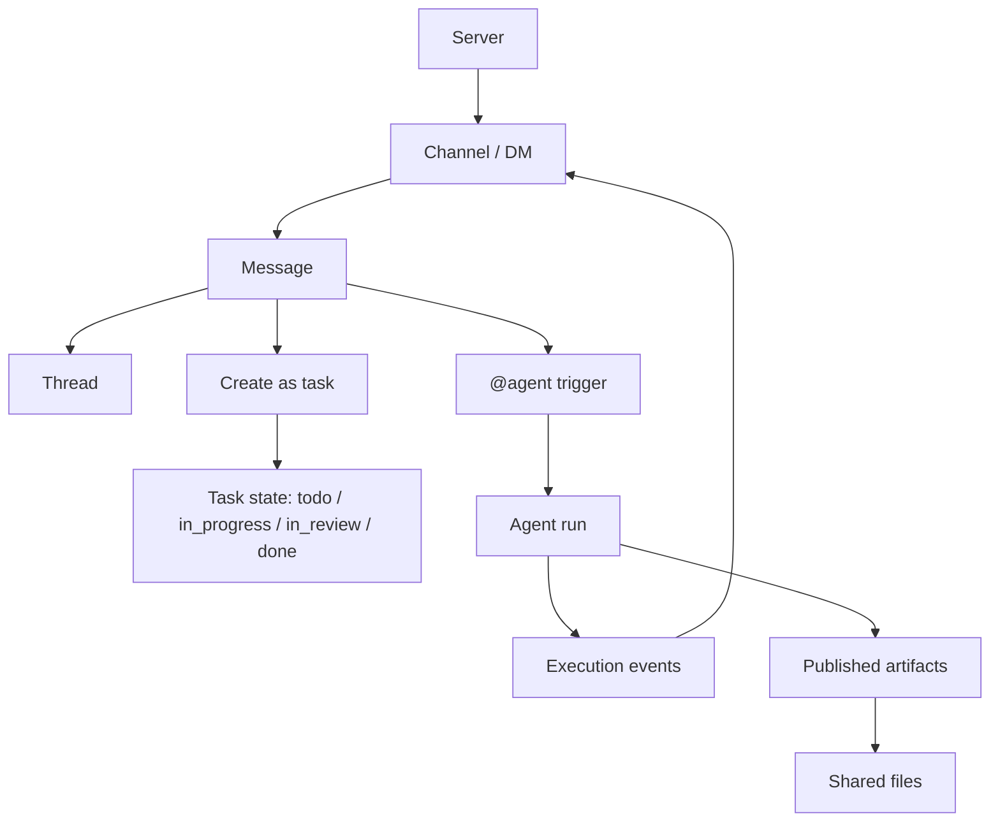

Poco 的 server 协作不是把聊天、任务和 Agent 执行拆成几个互不相干的页面，而是把它们放进同一个 conversation-first 模型。你先进入 server，再在 channel 或 DM 中对话、开 thread、派生 task、`@agent`，最后把执行结果和共享产物沉淀回同一个协作空间。

## 协作主线

Server 是长期协作边界，channel 和 DM 是一等 conversation，message 是所有协作事实的入口。Task、thread、agent run 和 artifact 都从 message 派生，因此后续状态变化可以追溯到原始讨论。

这条主线有三个设计重点。

- **对话先于任务**：用户可以先讨论，再把明确事项转成 task。
- **运行绑定上下文**：Agent run 不脱离 channel 或 DM 独立存在。
- **产物显式共享**：公开成果进入 shared files，私有状态不自动公开。

## 本专题包含什么

你可以按下面四个角度理解这套新协作主线。

- [Server 与成员边界](./servers-and-membership)
- [对话、thread 与任务派生](./conversations-and-tasks)
- [持久化 agent 与执行可观测性](./persistent-agents)
- [共享上下文与公共成果树](./shared-context-and-artifacts)

## 适合哪些场景

这套协作模型适合多人、多 Agent、长任务和需要回看执行证据的工作。它不是单次问答产品，而是把团队讨论、任务推进、代码执行、产物检查和后续复用串成一条可追踪链路。

| 场景                     | Poco 的组织方式                                     |
| ------------------------ | --------------------------------------------------- |
| 团队围绕一个项目持续讨论 | 使用 server 和 channel 承载长期上下文。             |
| 某段讨论变成明确事项     | 从 message 或 thread 显式创建 task。                |
| 需要 Agent 处理一项工作  | 在 channel 或 DM 中 `@agent` 触发 run。             |
| 需要复用执行成果         | 将产物发布到 shared files，而不是共享整个工作目录。 |
