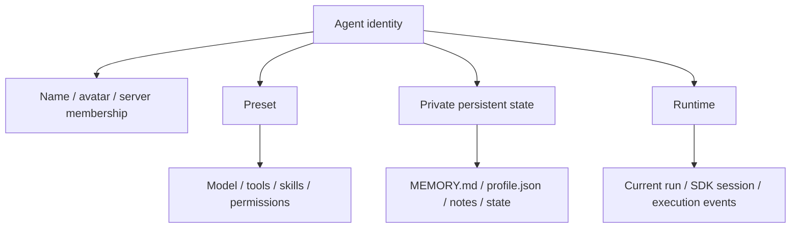
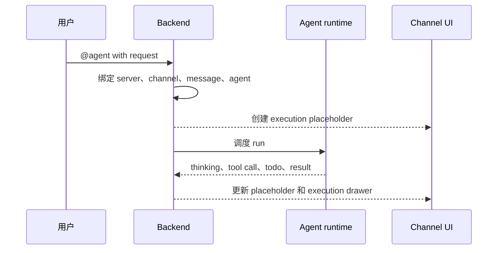
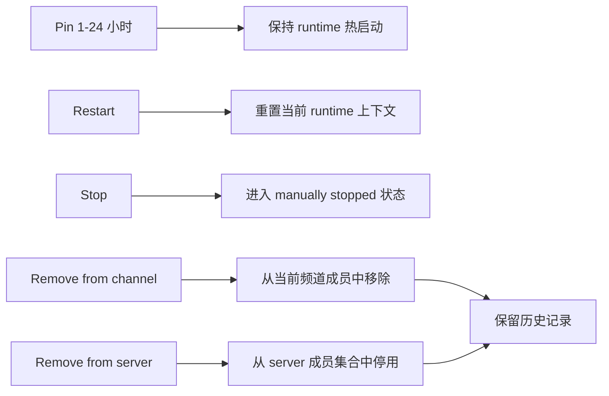

Poco 里的 server agent 不只是一个 prompt 配置。它有稳定身份、可复用 preset、私有持久状态目录和可恢复运行时，因此可以像长期同事一样参与 channel 协作。

## 四层模型

持久化 agent 可以拆成四层：identity 负责协作身份，preset 负责能力配置，persistent state 负责长期记忆，runtime 负责一次或多次实际执行。

这四层不能混在一起。更换 preset 不等于删除历史身份，重启 runtime 不等于清空长期状态，移出 channel 也不等于抹掉历史消息。

## 当你在频道里 @agent 时会发生什么

Poco 会按 owner key 命中该 agent 的持久运行时，并在可能时恢复同一份长期上下文，然后立刻在消息流里创建 execution placeholder。主消息流展示紧凑进度，execution drawer 展示完整执行细节。

## 私有状态和单写者

每个 agent 有独立 private persistent state，默认只有一个可写持久运行时。这个单写者模型避免多个并发 run 同时修改长期记忆、工作笔记和状态文件。

- `MEMORY.md` 保存稳定约束和偏好。
- `profile.json` 保存结构化身份信息。
- `notes/` 保存长期协作笔记。
- `state/` 保存运行所需的结构化状态。

一次回复结束后，runtime 会先进入 `warm_idle`，在空闲窗口到期后再进入 `sleeping`。这里默认做的是 `stop` 容器，而不是 `remove` 整个长期 runtime 状态。Workspace、私有 `/agent_state` 和可恢复 session 锚点都会保留，因此下一次 mention 可以恢复同一个 agent，而不是重新创建陌生身份。

## 运行控制和移除语义

Poco 把 `Pin`、`Restart`、`Stop`、`Remove from channel` 和 `Remove` 区分成不同操作。Pin 用于在 `1-24 小时` 的有限租约内保持 runtime 热启动，重启与停止处理 runtime，channel 移除处理当前频道可见性，server 移除处理成员集合，但历史消息、reaction、执行记录和已发布产物仍然保留。

`Stop` 的语义也强于自动休眠。`sleeping` 状态下，普通 mention 可以自动恢复；而 `manually_stopped` 状态下，普通 mention 不会自动拉起，必须由 owner 显式重新启动或重启。

