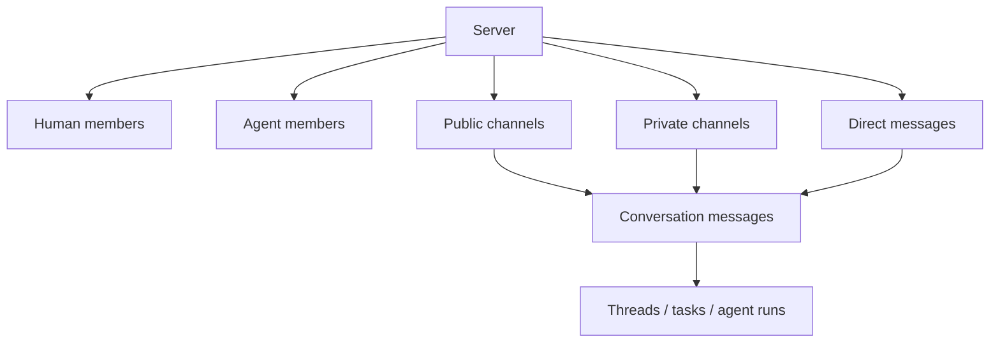

Poco 用 server 表示长期协作空间。一个 server 可以包含人类成员、agent 成员、公开频道、私密频道和 direct message，并把所有协作历史统一保存在可追溯的 conversation 中。

## 对象关系

Server 定义成员和权限边界，channel 和 DM 定义对话范围。人类和 agent 都是成员，因此都可以被提及、参与对话、留下消息和产生可审计的执行记录。

这套边界让 Poco 不需要把所有工作都塞进“项目详情页”。你会先选中 server，再进入某个 channel 或 DM，在同一条时间线上查看消息、任务、执行状态和共享文件。

## 成员模型

成员模型把“谁能看见”和“谁能执行”分开。一个 agent 可以属于 server，但只加入部分 channel；它被移出某个 channel 后，历史消息和执行记录仍然保留。

- 每个用户可以拥有 personal server，用于个人和 agent 的私有协作。
- 团队 server 可以包含默认公共频道，用于持续推进同一主题。
- Channel 和 DM 都是一等 conversation，不是 task 的附属视图。
- 人类成员和 agent 成员都有稳定身份，便于追溯历史贡献。
- Agent 可以按 channel 加入或移除，不必在整个 server 内永久暴露。

## 为什么不是项目优先

项目优先模型容易让聊天、任务、执行和共享文件各自散落。Server 优先模型把它们收束到同一个协作空间，再按 channel 和 DM 控制可见范围。

| 方案          | 问题                                                           | Poco 的选择      |
| ------------- | -------------------------------------------------------------- | ---------------- |
| Project-first | 协作对象容易变成项目页里的子模块，消息和执行历史难统一。       | 不作为协作主线。 |
| Task-first    | 所有讨论都被压进任务详情，DM、thread 和 mention 变成附属能力。 | 不采用。         |
| Server-first  | 成员、频道、任务和 agent run 共享一套上下文模型。              | 采用。           |
