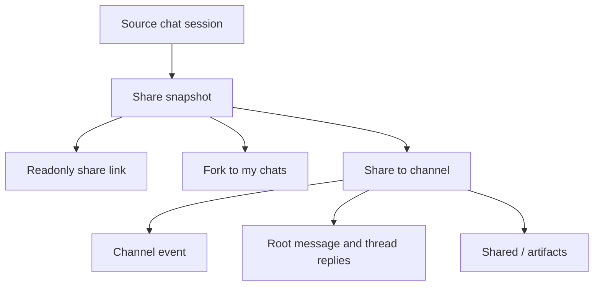
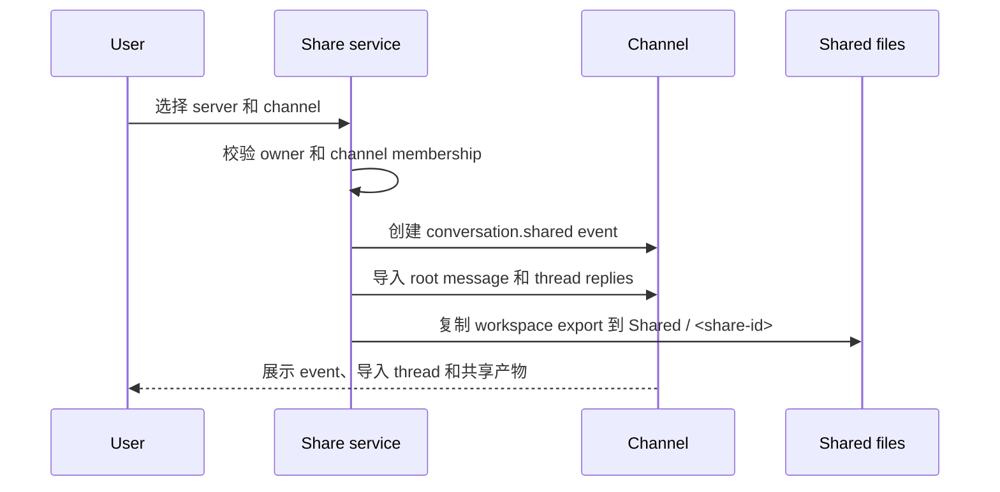

Poco 把 share 设计成普通聊天和频道协作之间的桥。一次普通聊天可以先被发布成只读 share link，也可以被其他用户 fork 到自己的普通聊天中继续，或者被导入到某个 server channel，成为频道里的 event、聊天消息、thread 和公共成果。

## Share 保留什么

Share 不是一张截图。Poco 会保存会话消息、run 摘要、timeline、可回放的执行细节，以及用于查看文件的 workspace export 信息，让其他人可以在之后重新审阅这次工作。

这样做的目标是保留足够完整的审阅证据，同时避免误把原始会话变成仍可继续操作的 live session。访问者看到的是只读会话界面，而不是一个可以继续发送消息的 composer。

## Share link

Share link 适合用来展示结果，或把一次完成的工作交给别人检查。

- 打开链接后展示只读聊天页面。
- 聊天区域保留普通聊天的阅读体验，但发送、重新生成、新建分支等交互会被禁用。
- 如果会话存在执行记录，右侧工作区可以展示 replay steps、tool activity、file changes 和导出的文件。
- 未登录用户可以查看只读页面，但需要创建用户状态的操作必须登录。

因此，share link 更接近一次发布动作，而不是临时截图。只要拿到 token，就可以查看这份 share snapshot 中包含的消息、执行证据和产物信息。

## Fork 到自己的普通聊天

已登录用户可以把 share fork 到自己的普通聊天中，用共享上下文继续推进。

Fork 会创建一个新的 chat record，复制消息、已完成 run 的摘要和 usage 记录。同时，新的会话会清空 SDK thread identity，后续输入会开启新的执行 thread，而不是继续原始会话的 agent 线程。这样可以保证 fork 后的继续工作不会反向影响 source chat 或 share link。

Fork 初始状态来自 share snapshot 中的 workspace export。如果用户在 fork 后继续执行新的 run，后续执行状态和 workspace export 会通过普通 callback 写入这个新的会话。

## 分享到频道

分享到频道用于把普通聊天中的成果发布到团队协作空间。

导入到频道后，会形成两层内容。

- 频道主时间线出现一条 `conversation.shared` event，让成员知道有普通聊天被发布进来。
- 第一个用户消息成为 root message，后续用户和 assistant 消息进入同一条 thread replies。这样可以保留完整内容，又不会把主频道刷成一长串历史消息。

如果被分享的聊天有导出文件，Poco 会把这些文件发布到频道的 `Shared / <share-id>` 下。这是频道侧的发布副本，不是直接暴露 source session 的 live workspace。

## Timeline 与审阅

只读 share 页面和频道 thread 都应保留 timeline 式审阅能力。主消息流负责快速阅读上下文；当用户需要定位证据时，再通过 timeline、execution panel 和 artifact tree 查看 run、tool call、file change 和产物。

这能避免把所有执行细节都塞进频道消息，同时仍然保留课程报告、调试复现和团队审阅需要的证据链。

## 边界总结

| 路径             | 适合场景                         | 发生了什么                                           |
| ---------------- | -------------------------------- | ---------------------------------------------------- |
| Share link       | 展示一次完成的普通聊天或审阅证据 | 创建 token 访问的只读页面                            |
| Fork to my chats | 基于共享上下文私下继续推进       | 创建用户自己的新普通聊天                             |
| Share to channel | 把成果发布到团队协作空间         | 创建频道 event、thread 和 `Shared / <share-id>` 产物 |

源会话只是 snapshot 的来源。之后的 fork、频道讨论和后续协作都会沿着新的上下文继续推进。
