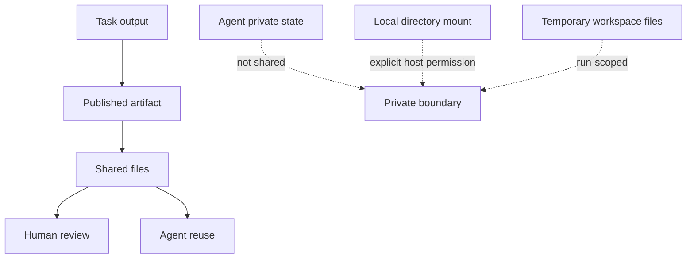
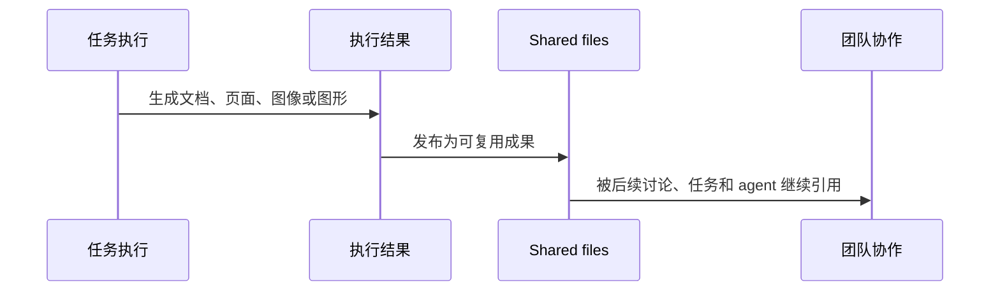

Poco 不会把一个频道直接当作共享文件夹来使用。它会把真正值得保留和复用的结果沉淀为公共成果，供后续成员和 agent 持续引用。私有状态、临时输出和宿主机目录仍然保持各自边界，不会混入同一层协作空间。

## 共享材料的边界

在 Poco 中，公开成果、私有状态、本地目录和临时工作区属于不同层次的内容。

频道中共享的是成果，而不是某个 agent 的完整工作目录。私有笔记、长期状态和宿主机目录不会自动进入共享文件体系。用户看到的应当是一棵可以持续复用的成果树，而不是底层文件结构本身。

## 共享成果如何沉淀

一次任务结束后，并不是所有文件都需要进入协作空间。只有那些会被后续讨论继续引用、并且确实具备复用价值的内容，才会沉淀为共享成果。

最终留下来的，是经过整理、可以继续使用的公共材料，而不是大量临时文件。对 agent 也是一样：既然已有成果已经足够支撑下一步工作，就不必反复从头生成相同内容。

## 共享文件如何在协作中被使用

同一份共享文件，有时用于阅读理解，有时则需要继续处理。Poco 将这两类使用方式明确区分。

### 直接理解内容

常见场景包括：
- 阅读说明文档
- 审阅 PDF 简历或报告
- 总结、比较、提建议
- 从已有材料中提取重点

这类场景的重点在于基于内容继续理解、分析和回应，而不是先把整份文件转成处理对象。

### 基于原文件继续处理

常见场景包括：
- 文档转换
- 版式调整
- 抽图、拆页、重排
- 其他依赖原始文件格式的工作

这类场景的重点不只是理解内容，而是继续处理文件本身。

将这两条路径区分开之后，阅读型任务可以保持轻量，而需要依赖原文件的任务也能够保留完整处理能力。

## 从引用到持续协作

在频道中引用共享文件，不只是为了减少重复粘贴，更重要的是让后续讨论始终围绕同一份材料展开。

用户可以明确告诉 agent 应该参考哪一份文件，而不必重复粘贴内容。即使频道中存在多份相似材料，后续任务推进、回复和新产物也仍然围绕用户选中的那一份继续展开。对于长讨论、多轮协作和多 agent 配合而言，这种稳定性比一次性塞入大量提示词更有价值。

## 为什么 Poco 这样设计

Poco 选择“共享成果树”，而不是“共享可写目录”，原因很直接：前者更适合真实协作。

| 方案 | 用户会遇到的问题 | Poco 的选择 |
| --- | --- | --- |
| 共享整个目录 | 容易混入临时文件、私有内容和无关结果，协作对象不清晰 | 不采用 |
| 只共享聊天消息 | 文件成果难以稳定复用，后续工作需要重复上传或重复生成 | 不采用 |
| 共享成果树 | 公开材料明确、可复用、可持续协作 | 采用 |

对用户来说，这种设计最直接的价值在于三点：公共材料边界更清楚，后续协作不容易丢失上下文，阅读材料与处理文件也能够分别走更合适的路径。
