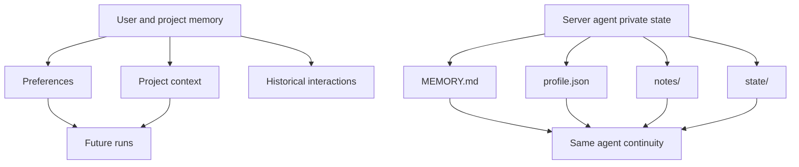
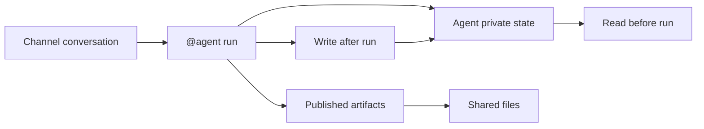

Poco 的记忆能力分成两层。第一层是通用记忆，用来保留你的偏好、项目上下文和历史交互。第二层是 server agent 自己的 private persistent state，用来维持长期协作中的角色记忆与工作状态。

## 记忆分层

通用记忆面向用户和项目，agent 私有状态面向某个长期 agent。两者都能改善连续协作，但生命周期和可见范围不同。

这套分层避免把所有长期信息都塞进 prompt，也避免把 agent 的私有工作状态误当成频道共享材料。

## 通用记忆会保留什么

通用记忆偏向跨会话、跨任务都稳定成立的信息。

- 个人偏好。
- 项目上下文。
- 历史交互。
- 对任务风格和输出格式的长期偏好。

随着使用进行，Agent 会越来越了解你的工作方式，让协作更顺手。

## Server agent 的私有长期记忆

在 server 协作里，agent 还会维护自己的 `MEMORY.md`、`profile.json`、`notes/` 和 `state/`。这些文件不属于频道公共成果树，而是该 agent 的私有持久状态。

如果某些内容需要被同频道人类或其他 Agent 复用，应发布为 artifacts；如果内容只服务该 agent 自身连续性，应留在 private persistent state。

## 边界对比

| 类型                | 可见范围                 | 适合内容                           |
| ------------------- | ------------------------ | ---------------------------------- |
| 通用记忆            | 用户或项目范围。         | 偏好、项目背景、长期稳定信息。     |
| Agent private state | 单个 agent。             | 角色记忆、工作笔记、结构化状态。   |
| Published artifacts | 当前频道或授权协作范围。 | 可共享成果、文档、报告、图形产物。 |
